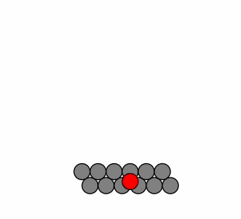

# test adhesion using spring mechanics with is_movable

```
cd PhysiCell-development
make
project    # better yet, use PhysiCell Studio to experiment
```

The model provided (by default, in `config/PhysiCell_settings.xml`) will create a rectangular cluster of cells. Most cells are of type `default`, but a single cell in the center is `ctype1`. We use spring mechanics for adhesion. The `default` cell types chemotax upward; the single `ctype1` does not chemotax, but is pulled along due to spring mechanics. We define a rule that makes the single `ctype1` cell become unmovable at ~120 min. 

Q: does this single cell act as an anchor to the other cells?

A: it seems not (here's the .gif results). Why? See line 262 in `core/PhysiCell_cell_container.cpp`)


